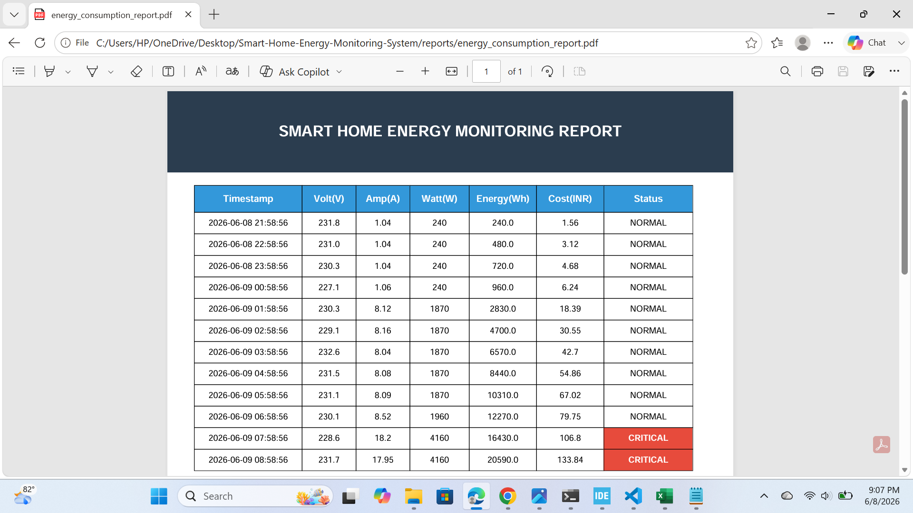

# Smart Home Energy Monitoring System
🚀 **An Industry-Oriented IoT Edge-to-Cloud Telemetry Pipeline & Simulation Engine**

This repository serves as a comprehensive IoT course design project and academic proof-of-work portfolio. It implements an industrial-grade end-to-end telemetry infrastructure through both an optimized **ESP32 hardware architecture pathway** and an executable **high-fidelity Python virtual simulation engine**.

---

## 1⃣ Project Explanation & Problem Statement

Traditional utility distribution grids obscure energy consumption metrics behind delayed monthly billing cycles. Homeowners and plant managers are left blind to standby power leaks, degrading appliance efficiency, and unexpected demand spikes. 

This project implements an **Edge-to-Cloud IoT telemetry loop** that monitors alternating current electrical parameters in real time. It calculates Root-Mean-Square (RMS) metrics, estimates ongoing electricity costs based on utility brackets, and features an automated circuit-breaker alert engine to isolate lines during overcurrent structural anomalies.

### Operational Data Pipeline Workflow

```text
  [Current & Voltage Sensors]
              ↓
  [ESP32 Edge Processing (High-Speed Sampling & RMS Calculation)]
              ↓
  [Secure Network Stream]
              ↓
  [Cloud Dashboard Visualizations (ThingSpeak)]
              ↓
  [Threshold Invariant Alert Engine]
              ↓
  [Local Automated Analytics Data Reports (CSV / Formatted PDF)]
```

---

## 2⃣ Industry Relevance & Business Value

Real-time energy tracking systems are widely deployed across modern commercial sectors:
* **Smart Homes & Buildings:** Optimizes structural HVAC operation profiles through real-time occupancy loads to reduce electricity bills.
* **Industrial Manufacturing (SCADA):** Pinpoints machinery phase imbalances and structural leakage points to protect heavy loads and eliminate utility peak-demand penalties.
* **Solar Energy Integration:** Dynamically coordinates local household power draws against active localized solar arrays to manage battery storage optimization.

---

## 3⃣ System Architecture & Component Breakdown

### Hardware Architecture Layer
* **ESP32 DevKitC Node:** A dual-core microcontroller that handles high-speed analog sampling loops on one core while managing asynchronous web connectivity threads on the other.
* **SCT-013-050 Current Clamp:** A non-invasive current transformer (CT) that measures magnetic flux around live wires safely without breaking circuits.
* **ZMPT101B Active Voltage Transformer:** An isolated step-down transformer module that converts AC mains waveforms into measurable low-voltage curves.
* **5V Optocoupler Isolated Relay:** Acts as an automatic circuit breaker, allowing the edge processor to disconnect loads instantly during a dangerous fault condition.
* **Audio Alarms & LEDs:** Provides sensory feedback (Buzzer & Red flashing indicators) when system states enter overcurrent boundaries.

### Virtual Simulation Layer
For environments where hardware deployments are inaccessible, the system contains an alternate execution pathway via a Python engine. This engine models household appliance profiles, calculates dynamic electrical draws, triggers edge alerts, and automates corporate data audit workflows.

---

## 4⃣ Repository Directory Blueprint

```text
Smart-Home-Energy-Monitoring-System/
├── arduino_code/          # C++ production micro-firmware for physical ESP32 nodes
├── python_simulation/     # Executable virtual load engine simulation scripts (main.py)
├── circuit_diagram/       # Structural hardware wiring wire-maps and specifications
├── data/                  # Tabular runtime log records (energy_log.csv)
├── reports/               # Automated corporate analytics audit report documents (PDF)
├── images/                # Validation snapshots and portfolio media blocks
└── requirements.txt       # Environment dependency manifest configuration
```

---

## 5⃣ Verification Outputs & Proof of Work

The project validation logs demonstrate system accuracy across normal baseline operations, heavy appliance surges, and critical overload conditions:

### 📊 Local Tabular Database Verification (`data/energy_log.csv`)
The engine dynamically writes all continuous telemetry readings to a local database. The snapshot below highlights the transition from typical operation to an automated overcurrent safety trigger:


### 📄 Corporate Audit Summary Verification (`reports/energy_consumption_report.pdf`)
At execution completion, the system automatically builds an executive PDF audit report. It includes clear structural grid tables and distinct red-highlighted alert blocks to draw immediate attention to dangerous overcurrent events:



---

## 🛠️ Step-by-Step Installation & Local Execution

Follow these steps to run the simulation engine on your machine and generate the validation reports:

1. Clone or download this project folder workspace into your directory disk.
2. Open your terminal window inside the root directory and install the necessary software libraries:
   ```bash
   pip install -r requirements.txt
   ```
3. Run the application to process the electrical loops and compile your data sheets:
   ```bash
   python python_simulation/main.py
   ```
4. Open the `data/` and `reports/` folders to view your newly compiled analytics logs.
